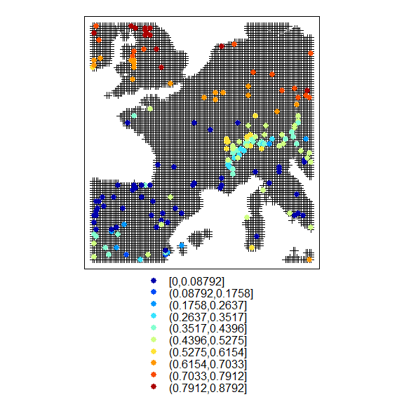
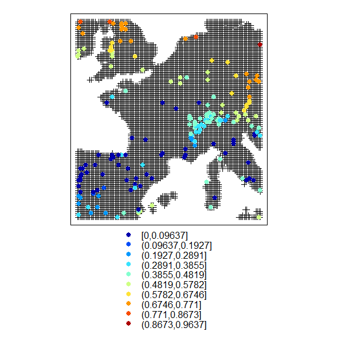

iSDM documentation
================

iSDM is an open-source R package that implements a few functions useful for modeling both the realized and potential distributions of non-native species in their invading range. Note however that these functions can also be used to model the realized and potential distributions of any species which has very limited dispersal abilities such as herbaceous forest plants, small mammals or any endemic species with a restricted range

How to get started
==================

Install and load the R package from CRAN using the following commands on the R console:

``` r
install.packages("iSDM")
library(iSDM)
```

To install the most recent version from GitHub:

``` r
install.packages("devtools")
devtools::install_github("TarekHattab/iSDM")
```

Generate the data required to run this example
==============================================

Get geographic data from the Worldclim dataset using the raster package

``` r
library(raster)
```

    ## Loading required package: sp

``` r
Worldclim<-getData('worldclim', var='bio', res=10)
envData<-crop(Worldclim,extent(-8, 15, 38, 55))
plot(envData[[c(1,5,6)]], main=c("BIO1", "BIO5", "BIO6"), col=bpy.colors(100))
```


Install the virtualspecies package to simulate the distribution of a virtual/fake species

``` r
#install.packages("virtualspecies")
library(virtualspecies)
```

Generate virtual species responses with formatFunctions

``` r
my.parameters<-formatFunctions(bio1=c(fun="dnorm", mean=140, sd=40), bio5=c(fun="dnorm", mean=230, sd=70), bio6=c(fun="dnorm", mean=10, sd=40))
```

Generate the distribution of your virtual species based on environmental conditions across the study area and the niche parameters you just have set in the former function for these environmental variables

``` r
potential.dist<-generateSpFromFun(envData[[c(1, 5, 6)]], my.parameters)
```

Constrain the distribution of your virtual species to a defined area below a latitudinal limit of 48°N (imagine it is a non-native invasive species invading from southern Europe and having its colonization front at a 48°N latitude)

``` r
realized.dist<-limitDistribution(x=potential.dist$suitab.raster, area=extent(-8, 15, 38, 48), plot=FALSE)
par(mfrow=c(1, 2), mar=c(2, 3.5, 2, 4))
plot(realized.dist$occupied.area, main="Realized distribution", col=bpy.colors(100))
plot(potential.dist$suitab.raster, main="Potential distribution", col=bpy.colors(100))
```


The eSample function
====================

The **eSample** function performs an environmental systematic sampling

Exemple using 2 ordination axes:

``` r
par(mfrow=c(1, 2), mar=c(2, 2.5, 2, 2.5))
Mysampling1<-eSample(envData, nExpect=200, plot=TRUE, saveShape=TRUE, nf=2, lowerLim=0.00001, upperLim=0.99999)
```

    ## [1] "-----------------Optimization of the 2 D grid size---------------------"
    ## 
      |                                                                       
      |                                                                 |   0%
      |                                                                       
      |==========================================                       |  64%
      |                                                                       
      |===================================================              |  78%
      |                                                                       
      |=====================================================            |  81%
      |                                                                       
      |=====================================================            |  82%
      |                                                                       
      |=======================================================          |  84%
      |                                                                       
      |========================================================         |  86%
      |                                                                       
      |=========================================================        |  88%
      |                                                                       
      |===========================================================      |  92%
      |                                                                       
      |============================================================     |  93%
      |                                                                       
      |==============================================================   |  95%
      |                                                                       
      |==============================================================   |  96%
      |                                                                       
      |================================================================ |  99%
    ## [1] "-----------------202 points found---------------------"

``` r
plot(envData[[1]], col=bpy.colors(100))
plot(Mysampling1[[1]], add=TRUE, col=1, pch=19)
```


Exemple using 3 ordination axes:

``` r
Mysampling2<-eSample(envData, nExpect=50, plot=TRUE, saveShape=TRUE, nf=3, lowerLim=0.001, upperLim=0.999)
```

    ## [1] "-----------------Optimization of the 3 D grid size---------------------"
    ## 
      |                                                                       
      |                                                                 |   0%
      |                                                                       
      |===========================                                      |  42%
      |                                                                       
      |==============================                                   |  46%
      |                                                                       
      |================================                                 |  50%
      |                                                                       
      |=======================================                          |  60%
      |                                                                       
      |============================================                     |  68%
      |                                                                       
      |===========================================                      |  66%
      |                                                                       
      |=================================================                |  76%
      |                                                                       
      |========================================================         |  86%
    ## [1] "-----------------52 points found---------------------"


The pDLA function
=================

The aim of using the **pDLA** function is to provide a continuous variable (cf. a probability value) to help sorting absence data into dispersal-limited absences (high pDLA values above a given threshold) and environmental absences (low pDLA values below the threshold)

We will first use the environmental systematic sampling desing (the object <Mysampling1> created using the **eSample** function) and the realized distribution map to generate a presence absence dataset (using a probability threshold of 0.5)

``` r
occData<-extract(realized.dist$occupied.area, Mysampling1[[1]])
occData<-data.frame(coordinates(Mysampling1[[1]]), SP=ifelse(occData>0.5, 1, 0))
coordinates(occData)<-~x+y
proj4string(occData)<-proj4string(envData)
plot(realized.dist$occupied.area, main="Realized distribution", col=bpy.colors(100))
plot(occData, col=ifelse(occData$SP==0, "red", "green4"), add=T)
```


The **pDLA** function computes the probability of detecting dispersal-limited absences within a network of presence-absence data

``` r
probability<-pDLA(occData=occData, envData=envData[[c(1, 5, 6)]], longlat=TRUE)
library(colorRamps)
spplot(probability, sp.layout=list("sp.points", as(realized.dist$occupied.area, "SpatialPointsDataFrame"), first=T,col=1), col.regions=matlab.like(100), cuts=10)
```



Example based on occurrences from both the invaded and the native ranges

``` r
envNative<-crop(Worldclim,extent(-90, -70, 20, 40))
native.dist<-generateSpFromFun(envNative[[c(1, 5, 6)]], my.parameters)
occNative<-as.data.frame(coordinates(native.dist$suitab.raster)[sample(which(values(native.dist$suitab.raster)>0.5), 100), ])
coordinates(occNative)<-~x+y
proj4string(occNative)<-proj4string(envData)
plot(native.dist, main="Native range distribution", col=bpy.colors(100))
plot(occNative, add=TRUE, pch=19, cex=0.8)
```


``` r
probability<-pDLA(occData=occData, envData=envData[[c(1, 5, 6)]], longlat=TRUE, occNative=occNative, envNative=envNative[[c(1, 5, 6)]])
spplot( probability, sp.layout=list("sp.points", as(realized.dist$occupied.area ,"SpatialPointsDataFrame"), first=T,col=1), col.regions=matlab.like(100), cuts=10)
```



The iForce function
===================

The **iForce** function computes a negative exponential dispersal kernel to account for dispersal limitation which is a feature of the realized distribution

``` r
par(mfrow=c(3, 3), mar=c(1.5, 1.5, 1.5, 1.5))
for (a in c(0.01, 0.03, 0.05, 0.06, 0.09, 0.1, 0.3, 0.6, 0.9)){
propagule<-iForce(occData, envData=envData[[1]], a=a, binary=TRUE, longlat=TRUE)
plot(propagule, main=paste("a = ", a), col=bpy.colors(100))
plot(occData, col=ifelse(occData@data[,1]==1, 1, 0), add=TRUE, cex=0.3)}
```


The plotRPD function
====================

The **plotRPD** function plots the realized distribution versus the potential distribution using a RGB colour space

``` r
plotRPD(x=potential.dist$suitab.raster, y=realized.dist$occupied.area, cex=0.5, xlab="Potential distribution", ylab="Realized distribution")
```


